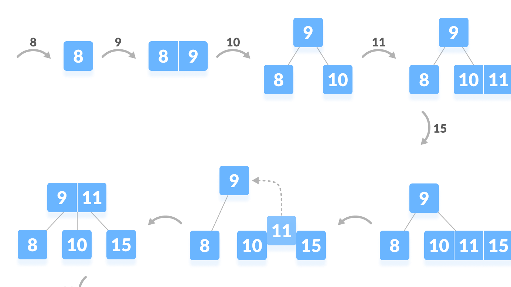
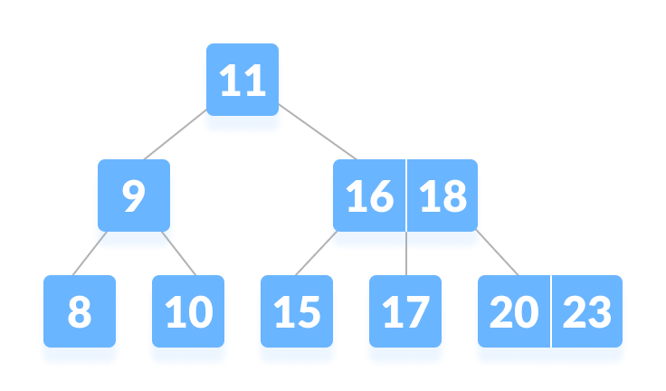
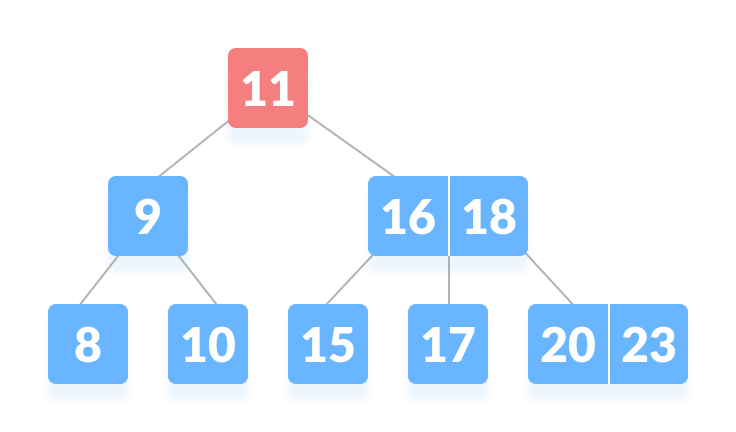
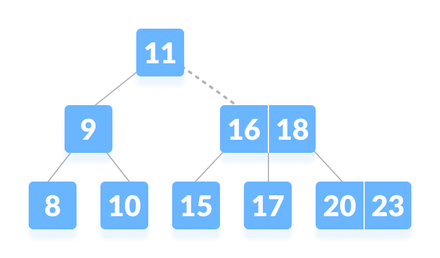
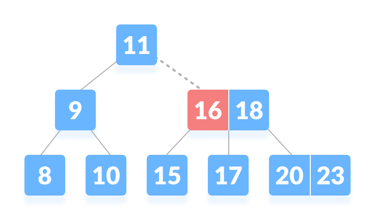
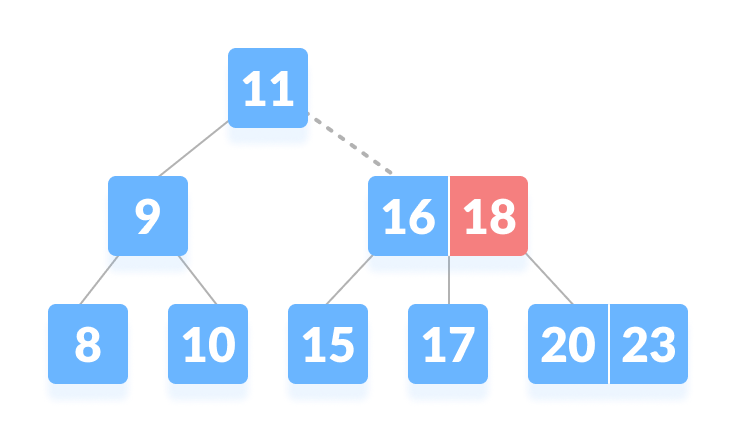
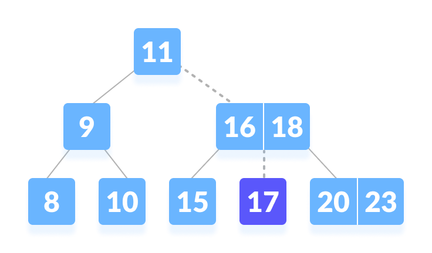
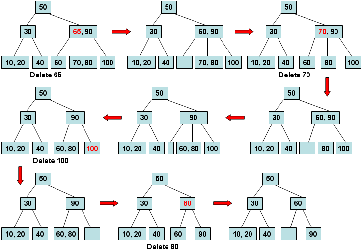

# Estructura BTree 

# Antecedentes

Esta es una estructura de tipo árbol inventada en 1970 por Rudolf Bayer, Edward M. McCreight meintras trabajaban en Boeing Research Labs, su propósito era el de realizar mas eficiente la indexacion de largos archivos de acceso aleatorio.

Bayer y McCreight nunca dieron a conocer el porque la B surgiendo teorias sobre que hacia referencia a Boeig, Balanced, Broad unicamente al respecto ellos dijeron "Mientras mas piensas en que significa la B en el BTree mas entiendes el BTree"

Esta es considerada una estructura avanzada que generaliza el Binary Search Tree (BST) permitiendo tener nodos con mas de un hijo además de poseer algoritmos de autobalanceo.

# Propiedades de un BTree

* Este tipo de arbol cuenta con un grado u orden nombrado usualmente con la letra m, este parametro corresponde al numero de hijos que puede tener como maximo cada nodo
* En relacion a m se pueden tener una cierta cantidad de llaves expresadas como (m-1) llaves esto sera como un arreglo de llaves ademas se tendrá un arreglo de punteros como se muestra en el ejemplo un Btree de orden 5 cuenta con cuatro llaves en el nodo y cinco punteros a nuevos nodos que tendran este mismo orden 

                                                ______________________________
                                                | | K1| | K2 | | K3 | | K4 | | 
                                                ──────────────────────────────
                                                 |     |      |      |      |
                                                 ▼     ▼      ▼      ▼      ▼
                                                 
* Todas las hojas deben estar del arbol deben estar al mismo nivel 

                                                 o                            o
                                                / \                          / \
                                               o   o                        /   \
                                              /   / \                      o     o
                                             o   o   o                    / \   / \
                                            / \                          o   o o   o
                                           o   o
                                                \
                                                 o
                                             No permitido                  Permitido 
                                             
                                             
 * Cada nodo (excepto raíz) tiene como mínimo (M)/2 claves.
 * El arbol deber estar ordenado en orden creciente 
                                                 

                                                
 # Complejidad de funciones                
 
 Algoritmo|Tiempo de Complejidad
 :---:|:---:
 Insert|O(log(n))
 Search|O(log(n))
 Delete|O(log(n))
 
 # Insert
 
 1.- Cuando el arbol esta vacio, crea nodo raiz e inserta ahi el valor o llave 
 
 2.- Meter llaves siguiendo las propiedades 
 
 3.- Cuando el nodo se llene 
 
 4.- Realizar un split sobre el mediano 
 
 5.- El valor del medio sube y conecta las llaves de la izquierda a un hijo izquierdo y las llaves de la derecha con un hijo derecho.
 
 

 
 # Search 
 
1.- Empezamos desde el nodo raiz comparamos valor de la llave del nodo

2.- Si valor = a la primera llave de ese nodo regresamos el nodo

3.- Si el valor llega a una hoja regresamos NULL pues no se encuentra

4.- Cuando se tienen nodos con mas de una clave donde valor > a la primera llave k1 se compara con la siguiente k2 si el valor es menor a la clave que sigue se toma la flecha ubicada entre la primera y segunda llave si es el caso contrario ir por la flecha de la derecha

5.- Repetir recursivamente 1 a 4 hasta hallar el nodo 

**Ejemplo**

Buscar el 17 en el siguiente BTree de orden 3

                                                
 Observamos que no es igual a la raiz así que comparamos con ella 
 
 
 
 17 > 11 lo que nos lleva por el camino de la derecha indicado con linea punteada
 
 
 
 Aqui comparamos con 16 donde 17 > 16 asi que comparamos con la llave siguiente de dicho nodo
 
 
 
 17 < 18 por lo que nos lleva por la flecha (puntero) que hay entre 16 y 18 
 
 
 
 llegando asi a 17 nuestra meta 
 
  
  
  # Remove
  
  Talvez esta represente la funcion mas elaborada debido a los multiples casos que se presentan 
  
  **Caso I**
  
  Borrar nodos Hoja
  
  a) Borrar un nodo y que esto no rompa la regla de cantidad minima de nodos: Solo eliminar 
  
  b) Borrar un nodo y que se rompa la condicion de cantidad minima de nodos:
  
      - Pedimos prestado una llave del hermano vecino inmediato de izquierda a derecha
      - Primero, vistamos al sibling izquierdo si tiene mas del numero mínimo de nodos tomamos uno
      - Sino ahora checamos al sibling derecho 
      
      Si los dos nodos hermanos inmediatos ya tienen un número mínimo de claves, aplicamos un merge con el nodo hermano 
      
      izquierdo o el nodo hermano derecho.
      
      Esta fusión se realiza a través del nodo padre.
  
  **Caso II**
  
  Borrar Nodos Internos
  
  1.- Si la llave a eliminar se encuentra en el nodo interno, ocurren los siguientes casos
  
  a) El nodo interno el cual será borrado es reemplazado por un predecesor si el hijo izquierdo tiene un numero de llaves por encima del mínimo
  
  b) El nodo interno el cual será borrado es reemplazado por un sucesor si el hijo derecho tiene un numero de llaves por encima del mínimo
  
  c) Si alguno de los niños tiene exactamente un número mínimo de llaves, haga merge entre los hijos izquierdo y derecho.
  
  **Caso III**
  
  Borrar nodos que reduzcan el nivel del arbol
  
  Si la llave de destino se encuentra en un nodo interno, y la eliminación de la llave conduce a una menor cantidad de llaves en el nodo (es decir, menos del mínimo requerido),   busque el predecesor en orden y el sucesor en orden. Si ambos niños contienen un número mínimo de llaves, no se podrá realizar el préstamo. Esto lleva al Caso II (3)
 
 
  Nuevamente, busque al hermano para que le preste una llave. Pero, si el hermano también tiene solo un número mínimo de claves,
  combine el nodo con el hermano junto con el padre. 
  Organice a los niños en orden creciente
  
  **Ejemplos**
  
  
  
  
  # Uso de la Estructura
  
  BTree nacio de la necesidad de queer acceder a los datos de una manera mas rápida y eficiente dichos datos se encontraban en medios de almacenamiento físico como Discos duros,   estos tipos de dispositivos son mucho mas lentos pero de mayores capacidades 
  
  Como pudimos observar la diferencia entre este tipo de arbol y el resto es el hecho de poder guardar mas de un valor en un nodo lo que reduce considerablemente la altura del     árbol y esto se tradujo en que cada nodo ocupe un bloque de disco, o un tamaño análogo en el dispositivo, aumentando la eficacia.
  
  # Aplicaciones Reales
  
  Bases de datos:
  
  Una base de datos es un conjunto de datos pertenecientes a un mismo contexto y almacenados sistemáticamente para su posterior uso. En este sentido; una biblioteca puede    considerarse una base de datos compuesta en su mayoría por documentos y textos impresos en papel e indexados para su consulta. Actualmente, y debido al desarrollo tecnológico de campos como la informática y la electrónica, la mayoría de las bases de datos están en formato digital, SQL apuesta por la incoporación de este tipo de arboles 
  
  
  Sistema de Archivos 
  
  El sistema de archivos o sistema de ficheros es el componente del sistema operativo encargado de administrar y facilitar el uso de las memorias periféricas, ya sean secundarias o terciarias. Sus principales funciones son la asignación de espacio a los archivos, la administración del espacio libre y del acceso a los datos resguardados. 
  

  # Especificaciones técnicas 
  
  Se incluye en este repositorio los siguientes archivos:
  
  * Btree.hpp
  * Arma.h
  * BaseSql.h
  * mainEstructura.cpp
  * mainProyecto.cpp
  * GTAV PROGRA.txt
  
  
  Al compilar el mainEstructura se mostrara un menu que permitirá crear un Btree y realizar las funciones básicas
  
  - Añadir valores
  - Borrar valores
  - Buscar valores
  - Imprimr Recorrido (Este se realiza de la misma forma que se haria inorder) para observar que los nodos estan en la estructura 
  
  Al compilar el mainProyecto se mostrara una pequeña aplicación cargando las armas del gtaV de entregas anteriores pudiendo verlas todas, eliminarlas, hacer busquedas y guardar lo que quede en la estrcutura de Btree comprobando el uso de esta estructura
  
  # Referencias 
  
  B-Tree : Searching and Insertion. (2020). Retrieved 3 December 2020, from https://iq.opengenus.org/b-tree-searching-insertion/
  
  B-tree. (2020). Retrieved 3 December 2020, from https://www.programiz.com/dsa/b-tree
  
  Introduction of B-Tree - GeeksforGeeks. (2020). Retrieved 3 December 2020, from https://www.geeksforgeeks.org/introduction-of-b-tree-2/?ref=lbp
  
  B-Tree Visualization. (2020). Retrieved 3 December 2020, from https://www.cs.usfca.edu/~galles/visualization/BTree.html
  
